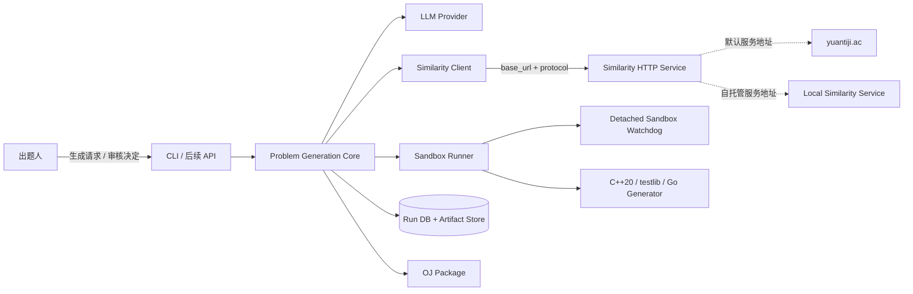
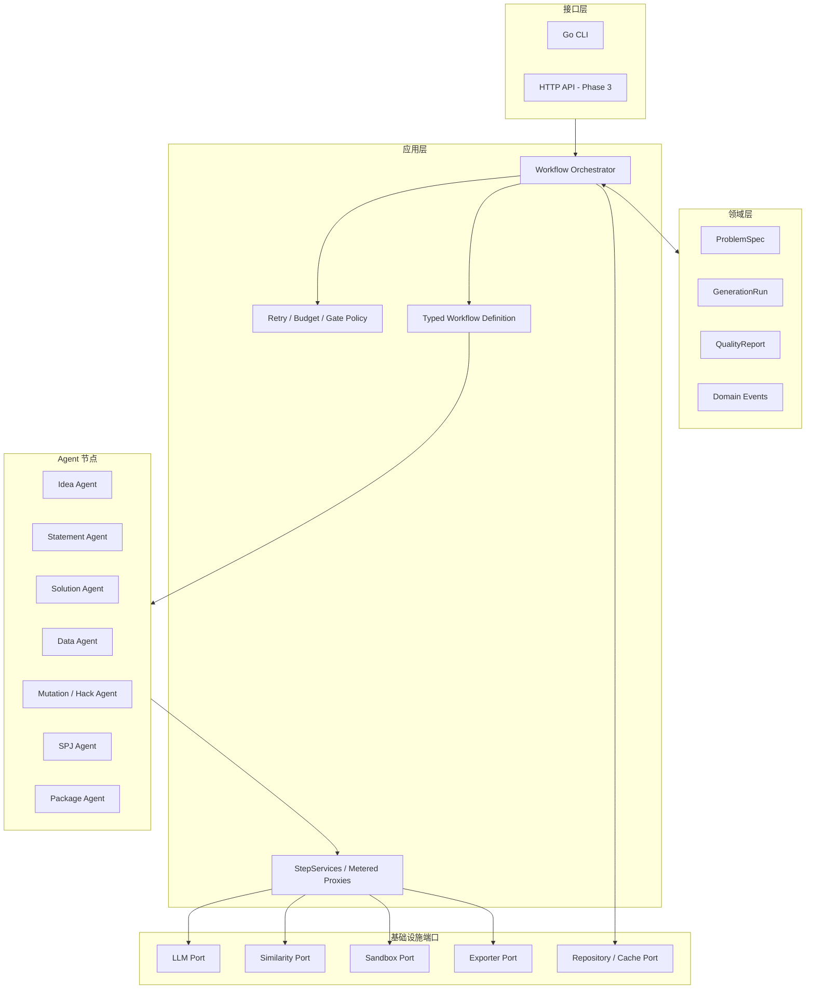
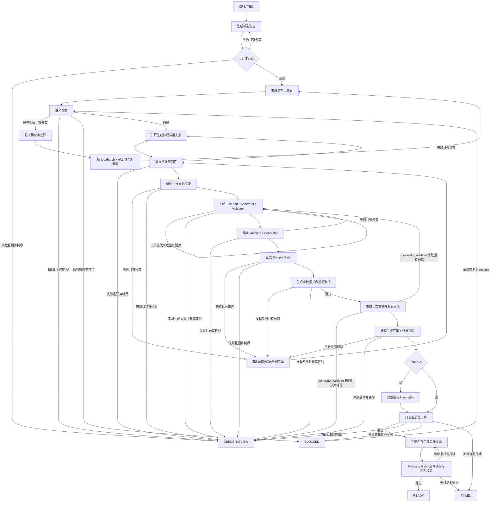
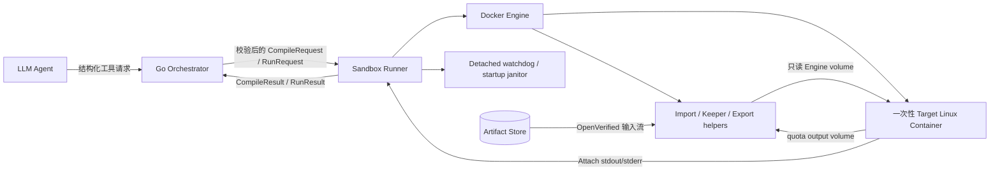

# 算法竞赛自动出题 Agent：需求分析与系统架构

> 状态：MVP 架构基线 v1.0（已冻结；架构变更必须新增 ADR）
> 输入依据：[plan.md](./plan.md)
> 目标：把自然语言需求稳定地转换为一套可验证、可追溯、可导出的 OJ 题目包。

## 1. 需求结论

### 1.1 核心用户故事

1. 出题人给出关键词、算法标签、难度、资源限制或留空随机生成。
2. 系统生成若干创意并筛选出一个新颖、可解、复杂度符合目标的候选题。
3. 系统产出题面、题解、标程、暴力程序、输入校验器、数据生成器和测试数据。
4. 系统通过编译、差分测试、数据合法性检查和性能测试证明题目包达到机器可验收状态。
5. 系统输出质量报告，并将通过质量门禁的产物导出为 OJ 题目包。
6. 第二阶段中，系统生成错误解并构造反例，持续增强数据；对非唯一答案题生成 SPJ。

### 1.2 MVP 功能范围

| 编号 | 能力 | MVP 验收条件 |
|---|---|---|
| F01 | 接收出题请求 | 支持关键词、算法、难度、语言、时空限制、随机种子及负向约束 |
| F02 | 创意生成与选择 | 生成多个候选；记录选择理由；失败时按预算变异重试 |
| F03 | 结构化题面生成 | 标题、描述、输入、输出、约束、样例和样例解释均可独立校验 |
| F04 | 语义查重 | 通过统一接口调用远端查重；结果、阈值和原始候选可追溯 |
| F05 | 解法生成 | 同时生成题解、C++20 标程和适用于小规模的暴力程序 |
| F06 | 数据工具生成 | 生成输入校验器和确定性数据生成器；每个数据点保存随机种子 |
| F07 | 自动判题验证 | 编译所有程序；小数据做标程/暴力差分；正式数据跑标程并生成答案 |
| F08 | 质量门禁 | 任一步失败不得被标记为 `READY`；失败原因进入质量报告 |
| F09 | 题目包导出 | 输出内部标准包；MVP 提供 Polygon 兼容导出器 |
| F10 | 缓存与恢复 | LLM、查重和编译结果可缓存；任务可从最近成功节点恢复 |
| F11 | 异常审核处置 | CLI 可查看证据并执行 revise/retry/waive/reject，所有决定可审计 |

### 1.3 第二阶段功能

- Wrong Answer Mutator：生成整数溢出、边界遗漏、错误贪心、状态缺失、复杂度退化等错误解。
- Hack Loop：比较标程和错误解，最小化并保存反例，将反例加入回归数据集。
- SPJ：为构造题、浮点题、多解题生成输出检查器，并用正例、合法异解、非法解测试检查器。
- 主动人工审核点：第二阶段允许在创意、题面和最终打包前按策略暂停；MVP 已提供处理异常 `NEEDS_REVIEW` 的最小 CLI，但不提供完整审核工作台。

### 1.4 明确不在 MVP 内

- Web UI、多租户、权限系统和计费。
- 分布式 Agent 服务、消息队列及 Kubernetes。
- 自动抓取并再发布第三方题面。
- 对“题目一定原创”作绝对保证；语义查重只能提供风险证据。
- 完全自动衡量趣味性、教学价值和真实比赛难度。

### 1.5 需要补齐的产品规则

`plan.md` 尚未给出下列规则。架构为其保留配置项，MVP 先使用可调整默认值：

- 新颖度阈值：不能只依赖单个相似度分数，应综合 Top-K 相似题、重排结果和审查理由。
- 重试预算：建议每个阶段单独计数，总 LLM 调用和总耗时另设全局预算。
- 目标难度：使用离散等级和预期算法复杂度表示，不承诺精确映射到某个平台 rating。
- 支持语言：MVP 题面为中文，解答程序统一 C++20，编排、状态机和 CLI 使用 Go。
- 题包规范：内部格式是唯一事实来源，Polygon 只是导出适配器，避免核心模型绑定某个 OJ。
- 任务处置策略：CLI 默认全自动运行；外部依赖暂时不可用时标记 `BLOCKED`，低置信度、内容证据冲突或生成预算耗尽时标记 `NEEDS_REVIEW`。

## 2. 架构原则与关键决策

### 2.1 模块化单体，而非微服务

MVP 是一个 Go 模块化单体和一个任务状态库。正常编排只有前台 CLI owner；另有同一二进制的窄 `sandbox-watchdog` 子命令，在 owner 异常消失后只负责按持久化 `watchdog_safety_deadline` 停止已标记 Docker 资源，不调度 Step、不生成 verdict，也不是独立 Agent/Worker 服务。各 Agent 是实现统一契约的工作流节点，不是独立部署的网络服务。LLM、查重、代码执行、存储和导出通过端口隔离，未来可以按压力单独拆出 Worker。

这样既满足“多智能体协作”和可插拔需求，又能减少远程调用编排、分布式事务、重复消费及部署成本。

### 2.2 确定性工具负责验证，LLM 负责提出候选

LLM 的输出始终视为不可信候选。编译器、输入校验器、差分测试器、资源限制执行器和导出校验器决定任务能否通过质量门禁。禁止用“另一次 LLM 判断正确”替代可执行验证。

### 2.3 结构化中间模型是唯一事实来源

节点之间不传递自由文本拼接结果，而传递带版本号的领域对象。题面 Markdown、源代码、测试文件和 OJ 包均从领域对象或制品引用生成。

### 2.4 所有生成均可复现和追溯

每个制品记录任务 ID、节点、输入哈希、提示词版本、模型标识、参数、代码工具链版本、随机种子和父制品。内容相同的制品以哈希去重。

### 2.5 执行面与编排面隔离

模型生成的 C++、校验器和 SPJ 属于不可信代码，只能在受限执行器中编译运行；它们不能读取项目密钥、宿主工作区或访问网络。

## 3. 系统上下文



外部依赖均位于适配器之后。查重服务或 Docker 暂时不可用时，任务不会假装通过质量门禁，而是进入可恢复的 `BLOCKED`；相似性证据模糊或生成预算耗尽时才进入 `NEEDS_REVIEW`。

## 4. 容器与组件架构



### 4.1 组件职责

| 组件 | 职责 | 不负责 |
|---|---|---|
| Workflow Orchestrator | 状态推进、并行节点、重试、超时、断点恢复、取消 | 直接拼提示词、直接运行代码 |
| Typed Workflow Definition | 在编译期组合类型化 Step，并按配置启用可选节点 | 运行时通过 `map[string]any` 动态拼接异构 Agent |
| Policy Engine | 判断重试、变异、人工审核和质量门禁 | 生成题目内容 |
| Idea Agent | 候选种子、可行性草案、负向约束、变异方案 | 宣布题目正确 |
| Statement Agent | 构建并修订结构化题面 | 决定算法和答案正确性 |
| Similarity Service | 查询并归一化 hits、能力、模型/索引版本和响应元数据 | 决定是否通过原创性门禁 |
| Solution Agent | 题解、标程、暴力程序及复杂度声明 | 在宿主机直接执行代码 |
| Data Agent | 数据计划、生成器、validator 和测试点清单 | 省略边界类别说明 |
| Judge Harness | 编译、运行、差分、资源统计、答案生成 | 使用 LLM 主观判断 AC/WA |
| Mutation/Hack Agent | 第二阶段错误解、反例搜索和最小化 | 修改已通过结果而不留版本 |
| SPJ Agent | 输出合法性规则及 checker | 输入格式校验；那是 validator 的职责 |
| Package Agent | 从已验证制品导出内部包和 OJ 包 | 绕过质量门禁 |

## 5. 领域模型与契约

### 5.1 关键领域对象

```text
GenerationRequestV1 (submitted)
  schema_version, mode(manual|random), brief?, keywords[], algorithm_tags[]
  language, topic_tags[], difficulty
  time_limit_ms, memory_limit_mb, required_features[], forbidden_features[]
  solution_language, verification_profile, seed?, budgets, export_targets[]

GenerationRequestSnapshotV1 (persisted)
  request_id, request_digest, submitted_request, effective_seed
  redacted_effective_config, effective_config_digest, created_at

IdeaBatch
  request_digest, requested_count, candidates[], generation_policy_version, effective_seed

IdeaCandidate
  idea_id, candidate_ordinal, seed_axes, abstract_task, intended_algorithm
  target_complexity, feasibility_status(FEASIBLE|REJECTED), feasibility_reasons[]
  negative_constraints[], parent_idea_id?, mutation_reason?, mutation_ordinal?

IdeaSelection
  request_digest, idea_batch_digest, selected_idea_id, selection_policy_version
  ordered_candidate_ids[], reason_codes[], evidence_digests[]

IdeaMutationIntent
  mutation_id, request_digest, source_batch_digest, parent_idea_id?
  trigger_kind(NO_FEASIBLE|SIMILARITY), trigger_evidence_digest
  stage_scope_digest, mutation_ordinal, mutation_reason, mutation_budget_claim_id

IdeaMutationRecord
  mutation_intent_digest, logical_operation_ids[], budget_reservation_ids[]
  budget_settlement_digest, output_batch_digest

StatementInput
  request_snapshot_digest, idea_batch_digest, idea_selection_digest
  selected_idea_id

ProblemSpec
  schema_version, request_digest, selected_idea_id
  idea_batch_digest, idea_selection_digest
  language, required_features[], forbidden_features[]
  title, statement, input_format, output_format
  constraints[], samples[], intended_algorithm, checker_kind
  time_limit_ms, memory_limit_mb

SolutionBundle
  editorial, reference_source, brute_source
  language, claimed_complexity, proof_outline

TestPlan
  groups[]: name, purpose, count, size_profile, generation_seed
  coverage_tags[], answer_mode(exact|spj)

SimilarityEvidence
  provider, query_digest, hits[], capabilities
  effective_options, model_version, index_version, response_metadata, call_trace

CallTrace
  logical_operation_id, dispatch_kind(DISPATCHED|CACHE_HIT|NO_DISPATCH)
  result_attempt_call_id?, physical_attempt_call_ids[]
  cache_source_attempt_call_id?, cache_pin_call_id?, decision_source_call_id?

SandboxExecution
  logical_operation_id, protocol/profile, resource_plan_digest
  engine_identity_digest, phase, resource refs[]
  result_attempt_call_id?, program_hard_deadline?, watchdog_safety_deadline?
  trigger_cause?, cleanup evidence

SimilarityDecision
  decision, policy_version, evidence_digest, reason, confidence_band

QualityReport
  checks[], metrics, warnings[], blockers[], final_decision

GenerationRun
  run_id, relation(GENERATED|DERIVED|VERIFICATION)
  state, execution_mode?(NORMAL|PROBING|QUIESCING), run_version
  workflow_revision, blocked_checkpoint?, active_probe_attempt_id?, current_revision_refs[]

VerifiedProblem
  problem_spec_ref, solution_bundle_ref, testplan_ref
  validator/checker/generator refs, current test/answer refs, gate_evidence_refs
  all input revisions/digests and verification profile

PrePackageQualityReport
  run_id, problem_revision, profile, current_gate_checks[], waivers[]

PackageVerificationReceipt
  package_id, verification_run_id, profile, environment_digest
  manifest_digest, prepackage_evidence_digest, gate_version, status

PackageOccurrence
  occurrence_id, package_id, run_id, relation, status(IMPORTED|VERIFIED)
  manifest_artifact, receipt_artifact?, final_quality_artifact?, verified_location

ReviewDecision
  review_id, run_id, step_id, attempt_id, scope, decision
  reviewer, reason, evidence_digests[], input_patch?, budget_delta?, waiver?

BlobRef
  digest, size

PendingArtifact
  blob_ref, relative_path, media_type, role
  call_id, reservation_id, writer_token_id, blob_pin_id
  physical_new_bytes, provenance_candidate

ArtifactOccurrence
  artifact_id, blob_ref, run_id, step_id, attempt_id, writer_token_id
  relative_path, media_type, provenance

PricingPolicyRef
  policy_id, digest, currency, accounting_unit
  effective_model_rates[], input_counter_version
```

约束、样例和相似题不得只存在于 Markdown 中；它们必须是可验证字段。每个对象包含 `schema_version`，为提示词、缓存和迁移提供稳定边界。

### 5.2 Agent 契约

工作流在 Go 代码中静态组装，不维护异构 `Agent Registry`。所有 Step 使用相同形状的泛型接口，各实例在编译期保留自己的输入输出类型：

```go
type Step[I any, O any] interface {
	Name() StepName
	Run(ctx context.Context, run RunView, services StepServices, input I) (AgentResult[O], error)
}
```

`RunView` 只暴露不可变任务 ID、配置、预算快照和已提交制品引用；读取集合时返回副本。`StepServices` 只包含该节点获准使用的带计量代理，不暴露裸端口：调用前原子预留次数/预估额度，完成后结算，按策略处理取消与基础设施失败的退款。Step 不能持有或修改任务快照，所有状态、预算和制品提交均由 Orchestrator 串行处理。可选节点通过静态工作流构造器和配置开关选择，不使用 `map[string]any` 绕过类型检查。

`AgentResult` 只能返回以下结果之一：

- `Succeeded(output, pending_artifacts, evidence)`
- `RetryableFailure(code, evidence, suggested_mutation)`
- `Blocked(dependency, evidence, retry_after)`
- `PermanentFailure(code, evidence)`
- `NeedsReview(reason, evidence)`

`pending_artifacts` 只包含已写入且校验过的不可变 Blob 与候选 provenance；Step/adapter 不能创建 `ArtifactOccurrence`。异常只表示未被正常分类的基础设施或编程错误，不能代替领域失败结果；编排器捕获异常后必须将暂时性外部故障归入 `BLOCKED`，不可恢复故障归入 `FAILED`。

### 5.3 端口契约

- `MeteredLLM.generate(request) -> MeteredOutcome[GenerateResponse]`
- `LLMAdapter.generate(DispatchAuthorization, request) -> LLMAttemptOutcome`
- `MeteredSimilarity.search(request) -> MeteredOutcome[SimilarityEvidence]`
- `MeteredDependencyProber.probe(request) -> DependencyProbeEvidence`
- `LLMAdapter.probe(DispatchAuthorization, request) -> CapabilityAttemptOutcome`
- `SimilarityAdapter.search(DispatchAuthorization, request) -> SimilarityAttemptOutcome`
- `SimilarityAdapter.health(DispatchAuthorization, request) -> CapabilityAttemptOutcome`
- `MeteredSandbox.compile(request) -> MeteredOutcome[CompileResult]`
- `MeteredSandbox.run(request) -> MeteredOutcome[RunResult]`
- `DockerSandbox.compile(SandboxDispatchAuthorization, request) -> CompileResult`
- `DockerSandbox.run(SandboxDispatchAuthorization, request) -> RunResult`
- `DockerSandbox.probe(SandboxDispatchAuthorization, request) -> DockerProbeResult`
- `MeteredArtifactSink.prepare(declaration) -> ArtifactWriter -> PendingArtifact`
- `VerifiedBlobReader.open(blob_ref) -> VerifiedReader`
- `ArtifactRepository.recordOccurrence(pending_artifact, provenance) -> ArtifactOccurrence`
- `RunRepository.load/save/append_event(...)`
- `PackageExporter.plan(VerifiedProblem) -> ExportPlan`
- `PackageExporter.export(VerifiedProblem, MeteredPackageWriter) -> ExportResult`
- `PackageExporter.verify(PackageReader) -> ExportVerification`

`HTTPSimilarityAdapter` 通过配置的服务地址调用查重服务。MVP 的 `protocol=yuantiji_v2` 使用 `POST /api/search`，请求核心字段为 `query`、`k`、`rewrite`、`rerank`、`skip_short` 和可选 `sources`。远端原题姬与自托管兼容服务只需切换 `base_url`；若未来服务使用不同请求/响应契约，则新增 `protocol` 实现，而不是把部署位置写入业务策略。所有响应都在适配器内映射为内部 `SimilarityHit`，业务层不得依赖 `cos`、`rr` 等供应商字段名。

```yaml
similarity:
  base_url: https://yuantiji.ac
  protocol: yuantiji_v2
  search_path: /api/search
  health_path: /api/health
  connect_timeout: 5s
  response_header_timeout: 15s
  operation_timeout: 120s
  max_request_bytes: 65536
  max_response_bytes: 4194304
  follow_redirects: false
  auth_token_env: ""
  failure_policy: blocked
```

`protocol` 提供路径和字段映射默认值，显式 `search_path/health_path` 覆盖协议默认值。适配器只产出 `SimilarityEvidence`；Policy Engine 使用版本化阈值和证据生成 `SimilarityDecision`。认证信息只允许通过环境变量引用，客户端强制 HTTPS（显式本地开发地址除外）、响应体上限和禁止跨域重定向。

内容寻址后端的低层 put 原语是 `MeteredArtifactSink` 实现包内的私有细节，不是应用端口；正式 run 的 Step、adapter 和其他“受信任组件”都不能取得它。GC、迁移、完整性扫描使用独立窄维护接口，只能 verify/quarantine/delete 已确认孤儿，不能创建 run provenance 或绕过预算写新产物。

## 6. 端到端工作流



该图表达业务主路径；用户取消、未分类异常和任意节点的基础设施故障，以 8.1 状态转移表及 6.2 修复路由为准。

### 6.1 并行边界

- 题面通过查重后，题解/标程和暴力解可并行生成，但必须在差分测试前汇合。
- 正式测试组可按 TestPlan 并行生成，随后逐个运行 validator。
- 标程可并行跑各测试点，但编译结果只生成一次。
- 非 SPJ 题先由标程生成 `.ans`；SPJ 题的 checker 与解法可以并行生成，最终必须进行交叉测试。

### 6.2 修复路由

验证失败不能一律“重新生成全部内容”。路由器先读取 `RunRelation(GENERATED|DERIVED|VERIFICATION)`、`InputOrigin(NONE|SAMPLE|GENERATED_TEST|IMPORTED_TEST|TRUSTED_FIXTURE)`、`ToolRole`、`ToolOrigin(BUILTIN|GENERATED|IMPORTED)` 和 outcome category，再依据失败证据最小化返工；优先级固定为 Sandbox `INFRA_ERROR` 或独立的 `FailureRouteClass=TRUSTED_TOOL_INFRASTRUCTURE`（可信 BUILTIN checker 故障） > VERIFICATION 内容失败 > GENERATED/DERIVED 内容修复。可信 checker 仍保留三层 Judge Outcome 的原始 `ProcessOutcome`/`CheckerOutcome=CHECKER_ERROR`，路由分类不覆盖它。`NONE` 只用于不依赖输入的 Compile；所有程序/语义执行必须使用其他 InputOrigin。`VERIFICATION` run 对被验包始终只读，任何内容错误只能形成 blocker/`FAILED`，需要修改时显式创建新的 `DERIVED` run。

| 运行关系 / 输入来源 | 失败证据 | 回退节点 |
|---|---|---|
| GENERATED/DERIVED | 与已知题高度相似 | Idea/Statement 变异 |
| GENERATED/DERIVED + SAMPLE | 样例与 Validator 冲突或与标程答案不一致 | Statement 与 Data/Solution 联合诊断，按证据修改最小 revision |
| GENERATED/DERIVED + SAMPLE | Slice 3 smoke 的 solution/brute 进程/样例解析错误 | Statement + Solution/Brute 联合诊断；不产生 Sample Gate evidence |
| GENERATED/DERIVED + GENERATED_TEST | generator 产生非法输入、Validator 错拒合法输入 | Data Agent 修订 generator/约束/validator |
| GENERATED/DERIVED | 标程与暴力不一致、标程超时 | Solution 修订并保留反例；复杂度不成立时回退 Idea |
| GENERATED/DERIVED | GENERATED/IMPORTED Validator/Checker `CE` 或程序级工具错误 | 分别由 Data/SPJ 产生新 revision；不覆盖 IMPORTED Blob |
| GENERATED/DERIVED | 生成 checker 接受非法答案或拒绝合法答案 | SPJ Agent 修订并保留攻击样例/合法异解 |
| VERIFICATION + 任意输入来源 | 任意题面/解法/数据/Validator/Checker 内容错误 | 保存 blocker 并 `FAILED`；可选建议创建 DERIVED run，不调用内容 Agent 修改导入包 |
| 任意关系 | Sandbox `INFRA_ERROR` 或 `FailureRouteClass=TRUSTED_TOOL_INFRASTRUCTURE` | 不进入 role adapter、不生成内容 revision；暂时性 `BLOCKED`，不可恢复 `FAILED` |
| GENERATED/DERIVED | 预算耗尽或内容证据冲突 | `NEEDS_REVIEW` |

## 7. 质量保证架构

### 7.1 不可跳过的质量门禁

1. Schema Gate：所有结构化对象通过字段和跨字段校验。
2. Compile Gate：标程、暴力、validator、generator/checker 编译或启动成功。
3. Sample Gate：题面样例输入合法，标程输出与样例输出一致；SPJ 题由 checker 验证。
4. Differential Gate：随机和枚举小数据必须先通过 validator；标程和暴力均成功执行后，exact 题使用配置的 checker 比较输出，SPJ 题分别验证两个输出合法性，必要时比较目标值。
5. Validator Gate：所有正式输入被接受；定向构造的非法输入被拒绝。
6. Determinism Gate：相同种子重跑 generator 得到相同内容。
7. Resource Gate：标程在最大测试上满足时间、内存和输出限制，并留安全裕量。
8. Coverage Gate：TestPlan 中声明的边界类别均至少被一个测试点覆盖。
9. Similarity Gate：保存 Top-K 证据并通过配置化策略；不可达不得视为通过。
10. Package Gate：导出包可反向读取，清单中的文件、哈希和答案均完整。

### 7.2 评测模型

`Judge Harness` 取代含义模糊的“评分模块”，它负责程序行为验证；`Quality Gate` 聚合证据并决定是否可发布。两者都不等于比赛中的分组计分器。

Judge 结果固定分为三层，避免把编译、进程终止方式和业务判决混在同一个 verdict 中：

- `CompileOutcome`：`OK/CE/INFRA_ERROR`。
- `ProcessOutcome`：`EXITED/SIGNALED/TLE/MLE/OLE/INFRA_ERROR`，同时保留 `exit_code` 或 signal，不赋予业务含义。
- `JudgeOutcome`：validator 为 `VALID/INVALID/VALIDATOR_ERROR`，checker 为 `AC/WA/PE/CHECKER_ERROR`。

`CE` 只出现在编译层，`WA/PE` 只出现在 checker 业务层。Judge Harness 必须先按运行角色解释 `ProcessOutcome + exit_code`，不能把所有非零退出码提前映射成 `RE`：

| 角色 | Process/exit code | 业务解释 |
|---|---|---|
| solution/generator | `EXITED/0` | 执行成功 |
| solution/generator | `EXITED/non-zero` 或 `SIGNALED` | `RE` |
| validator (testlib) | `EXITED/0` | `VALID` |
| validator (testlib) | `EXITED/FAIL_EXIT_CODE`（固定构建默认 3） | `INVALID` |
| validator (testlib) | 其他退出、signal 或资源失败 | `VALIDATOR_ERROR` |
| checker (testlib) | `EXITED/OK_EXIT_CODE`（默认 0） | `AC` |
| checker (testlib) | `EXITED/WA_EXIT_CODE`（默认 1） | `WA` |
| checker (testlib) | `EXITED/PE_EXIT_CODE` 或 `DIRT_EXIT_CODE`（默认 2/4） | `PE` |
| checker (testlib) | `EXITED/FAIL_EXIT_CODE`（默认 3）或未知退出码 | `CHECKER_ERROR` |
| validator/checker | `SIGNALED/TLE/MLE/OLE/INFRA_ERROR` | 对应工具错误 |

testlib 退出码可以在编译时通过宏修改，因此 Runner 不读取散落的魔法数字；`cpgen-builder` 固定 testlib digest 和编译宏，并随工具链 manifest 提供版本化 `testlib_v1` 映射。MVP 不支持 points/partial verdict，遇到相关或未知退出码按 `CHECKER_ERROR` 处理。validator 的 `INVALID` 表示“validator 按协议报告非法”，是否符合预期由正例/负例门禁判断。

运行结果至少记录：

- 原始 `exit_code`、可用时的权威 signal、wall/cpu time、可用时的 peak RSS、measurement profile 及 stdout/stderr 大小。
- 编译器版本、编译参数、可执行文件哈希。
- 输入、期望输出、实际输出和 checker 版本的制品引用。
- 超时、内存超限、运行错误、答案错误、输出超限等标准化 verdict。

### 7.3 SPJ 特有门禁

- 标程答案必须被接受。
- 至少一组与标程文本不同但语义合法的答案应被接受（若题目允许）。
- 缺项、越界、重复、格式污染和针对 checker 的构造输出应被拒绝。
- checker 必须受与选手程序相同等级的超时、内存和输出约束。
- SPJ 的职责是验证选手输出，输入合法性仍由 validator 保证。

## 8. 状态、存储与缓存

### 8.1 任务状态机

| 当前状态 | 事件/守卫条件 | 下一状态 |
|---|---|---|
| `CREATED` | 用户启动任务且配置有效 | `RUNNING` |
| `RUNNING` | Docker、查重服务或所需模型暂时不可用，有限重试耗尽 | `BLOCKED` |
| `BLOCKED` | 用户或自动策略执行 resume 并取得 lease | `RUNNING(mode=PROBING)` |
| `RUNNING(mode=PROBING)` | 计量探测确认依赖恢复 | `RUNNING`（恢复原 step） |
| `RUNNING(mode=PROBING)` | 探测仍不可用且已收敛 | `BLOCKED` |
| `RUNNING` | 相似性证据模糊、内容证据冲突或生成预算耗尽 | `NEEDS_REVIEW` |
| `RUNNING` | 取消、`run_budget_deadline/step_deadline`、revision/lease 失效或并行分支需要收敛 | `RUNNING(mode=QUIESCING)` |
| `RUNNING(mode=QUIESCING)` | 所有 target 已确认 STOPPED，调用/预算/清理义务已安全收敛 | 按原 cause 进入 `RUNNING/BLOCKED/NEEDS_REVIEW/CANCELLED` |
| `NEEDS_REVIEW` | 人工选择修改/批准继续，并提供必要输入 | `RUNNING` |
| `RUNNING` | 所有配置要求的质量门禁通过 | `READY` |
| `CREATED/BLOCKED/NEEDS_REVIEW` | 用户取消且无在途 SandboxExecution | `CANCELLED` |
| `RUNNING/BLOCKED/NEEDS_REVIEW` | 不可恢复的配置、数据或基础设施错误 | `FAILED` |

`BLOCKED` 是运行条件状态，不代表题目内容有问题；编排器可在 resume 取得 lease 后先进入受限 `RUNNING(mode=PROBING)`，用正常预算和取消协议探测依赖，再恢复或回到 `BLOCKED`，不会在暂停态旁路计量。`NEEDS_REVIEW` 是产品决策状态，必须由人选择修改、接受某项证据或终止任务。两者都保存检查点，但不能被标记为 `READY`。

`CleanupPending` 不是新的 RunState：它表示某个持久化 `SandboxExecution` 尚未确认 target 停止/证据或输出收敛，此时 run 保持 `RUNNING(mode=QUIESCING)`。只有清理前置条件满足后才能提交 `CANCELLED/BLOCKED/NEEDS_REVIEW/READY`，Docker 失联不能用空白 `BLOCKED` 掩盖可能仍在运行的容器。

`BLOCKED -> RUNNING(mode=PROBING)` 与新建 `DEPENDENCY_PROBE` attempt 在同一事务完成；探测调用只挂到该新 attempt，不能追加到已 `FINISHED+BLOCKED` 的旧 STEP attempt。探测结束后先关闭 probe attempt，健康时再为原 step 创建新 STEP attempt，失败时回到 BLOCKED。

任务内部使用步骤状态 `PENDING/RUNNING/SUCCEEDED/RETRYING/BLOCKED/NEEDS_REVIEW/FAILED/CANCELLED/SKIPPED`。结果映射如下：

| Agent/系统结果 | StepState | RunState | 后续动作 |
|---|---|---|---|
| `Succeeded` | `SUCCEEDED` | 保持 `RUNNING`；所有门禁完成后为 `READY` | 原子提交输出、证据和预算 |
| `RetryableFailure` 且有预算 | `RETRYING` | `RUNNING` | 按策略产生下一 attempt |
| `RetryableFailure` 且预算耗尽 | `NEEDS_REVIEW` | `NEEDS_REVIEW` | 等待 `ReviewDecision` |
| `Blocked` | `BLOCKED` | `BLOCKED` | 探测依赖后 resume |
| `NeedsReview` | `NEEDS_REVIEW` | `NEEDS_REVIEW` | 等待 `ReviewDecision` |
| `PermanentFailure` | `FAILED` | `FAILED` | 保存证据并终止 |
| 用户取消/context cancelled | 清理完成后 `CANCELLED` | 先 `RUNNING(mode=QUIESCING)`，target 全部 STOPPED 后 `CANCELLED` | 使用独立 cleanup context 收敛并保存证据 |
| 未分类内部异常 | `FAILED` | `FAILED` | 记录错误并终止，禁止盲目重试 |

上表的 `context cancelled` 仅指由用户 CANCEL control request 触发的根 context。并行 quiesce、revision 失效或 lease 丢失造成的内部取消只结束当前 Attempt，未完成 Step 回到 `PENDING` 或由新 owner 标为 `ABANDONED`，不得把 run 误标为 `CANCELLED`。

执行 context 的 cause 是闭集：`user_cancel`、`quiesce`、`revision_invalidated`、`lease_lost`、`step_deadline`、`run_budget_deadline`；目标程序的 `program_hard_deadline` 单独产生 TLE。前六种 cause 都先触发 QUIESCING，并在独立 cleanup context 中收敛 Docker 资源，不能用一个含义模糊的 `deadline` 混用。

人工处置必须创建版本化的 `ReviewDecision`，不能只切换状态。`decision` 至少支持 `REVISE/RETRY/WAIVE/REJECT`：

- `REVISE` 必须携带输入或配置修改；`RETRY` 必须携带预算增量或新的外部条件证据。
- `WAIVE` 必须记录门禁 ID、作用域、证据 digest、理由和 reviewer，Quality Gate 读取该对象后才能继续。
- Similarity 风险等主观门禁可以在策略中声明为可豁免；编译、Sandbox 完整性、正式输入合法性和题包完整性等确定性门禁不可豁免。
- Waiver 绑定 run、ProblemSpec revision、gate ID、Policy 版本和 evidence digest；任一绑定项变化时自动失效。
- `REJECT` 在下一次 resume 原子应用时将任务转为 `FAILED`。`NEEDS_REVIEW` 的 resume 若没有可应用且造成实际输入、预算、策略或 waiver 变化的 ReviewDecision，必须拒绝；`BLOCKED` resume 则允许在 retry_after/backoff、预算、CANCEL 和 fencing 守卫下进入受计量 PROBING，无需事先证明依赖已恢复。

每次状态变更先追加事件，再更新当前快照，以支持崩溃恢复和审计。

### 8.2 MVP 存储方案

- SQLite：任务、步骤尝试、逻辑调用/物理 AttemptCall、持久化 SandboxExecution、事件、快照、预算、审核决定、缓存索引和 `ArtifactOccurrence`。
- 内容寻址文件存储：`artifacts/<sha256-prefix>/<sha256>` 只保存不可变 Blob；相同 digest 可被多个 occurrence 引用，各自保留独立 provenance。
- 工作目录：每个沙箱尝试使用独立临时目录；完成后只提升清单引用的制品。
- 最终题包：位于 `output/<problem-slug>/<run-id>/`；Orchestrator 独占 staging/publish 权限并持有 `MeteredPackageWriter`，Package Agent/Exporter 只能通过受限 writer 写已声明路径。

题包的内容身份与验证关系分离：`package_id` 唯一标识不可变目录内容，`PackageOccurrence` 记录某个 generation/verification/derived run 对该 ID 的验证、receipt、最终 QualityReport 和安全路径。同一 package ID 可被多个独立 verification run 引用，不能把内容身份一对一绑定生成 run。

每个 run 采用带 execution lease/fencing token 的单写者提交模型。Orchestrator 可以并行执行 Step，但所有状态写入按 run 串行化，并在一个 SQLite 事务内追加事件、更新带 `version` 的快照、扣减预算、记录 attempt 和建立 artifact occurrence。Blob 可以提前幂等写入；只有所有 Blob 校验完成后才能在事务中把步骤标记为成功。恢复只能在旧 lease 过期且新 owner 取得更高 fencing token 后进行；遗留 `RUNNING` attempt 被标记为 `ABANDONED`，再使用稳定 attempt ID 和缓存键决定重跑或复用，禁止直接假定成功。跨 CLI 取消通过仅能表达 `CANCEL` 的持久化 control request 送达当前 owner；它不构成第二个工作流 writer。新建预算 reservation 与物理调用 authorization 必须在同一数据库守卫事务中验证有效 fencing、`RUNNING`、execution-mode capability 和无 active CANCEL：NORMAL 仅 current Step，PROBING 仅 checkpoint dependency probe，QUIESCING 不得新授权。取消后只允许已有资源结算/清理。暂停态/终态在在途工作收敛后释放 lease。每个 artifact writer token 以组合 FK 绑定同一 AttemptCall 的 `ARTIFACT_BYTES` reservation 及声明 subkey，并以 CAS 单次消费；pin/occurrence 再以组合 FK 绑定 token 的最终 digest/size，occurrence 只能引用 FINALIZED token。

缓存键建议为：

```text
sha256(
  component_name + component_version + schema_version +
  normalized_input + provider + model + sampling + prompt_digest
)
```

非确定性 LLM 输出命中缓存后必须保留原 provenance。编译缓存键包含规范化 SourceBundle manifest、全部有序 `(安全路径, Blob digest)`、EntryPoint、工具链镜像摘要、参数、platform/arch；不能用单个源码 Blob 代表多文件构建。运行输出默认不缓存；只有角色白名单允许且通过 Determinism Gate 的 generator/工具才能缓存，键包含输入制品、镜像、platform/arch 和 Runner profile digest。MVP 不缓存 Resource Gate 的时间/内存结论，防止跨宿主复用性能结果；若未来缓存，键必须额外包含 `verification_profile`、OS/arch、Docker/内核、CPU 基准指纹和资源配置。

Similarity 使用两级缓存：Evidence cache 的键包含 query、服务身份、协议、实际 rewrite/rerank 选项及模型/索引版本；Decision cache 的键为 evidence digest + Policy 版本。调整阈值时只重算决策，不重复请求远端。服务无法报告版本时，只允许短 TTL Evidence cache，不能长期复用原创性决策。

### 8.3 题目包内部格式

```text
problem-package/
├── manifest.json
├── statement/
│   ├── zh-CN.md
│   └── samples.json
├── solution/
│   ├── editorial.md
│   ├── reference.cpp
│   └── brute.cpp
├── judge/
│   ├── validator.cpp
│   ├── checker.cpp             # 默认 token checker 或生成的 SPJ
│   └── generator/
├── tests/
│   ├── 001.in
│   ├── 001.ans
│   └── ...
├── reports/
│   ├── similarity.json
│   ├── prepackage-quality.json
│   └── provenance.json
└── export/
    └── polygon/                # 导出产物，不作为事实来源
```

`manifest.json` 包含格式版本、资源限制、checker 类型、测试组、文件哈希和生成 run ID。Package Gate receipt 和最终综合 QualityReport 位于被校验包的哈希闭包之外，并通过最终 package ID 绑定，避免报告自引用。

## 9. 失败处理与预算

### 9.1 分层重试

- 网络错误、429、5xx：由 Metered proxy 控制重试循环、指数退避和随机抖动，并遵守服务端 `Retry-After`；adapter 每次只执行一个已取得 reservation 的物理请求，不在计量层下静默重试。
- LLM Schema 错误：同一输出执行一次结构修复，仍失败再回到 Agent 策略重试。
- 领域验证失败：由 Policy Engine 携带具体证据发起定向修订，不做盲目网络重试。
- 编译/运行失败：保留日志和最小反例，进入对应 Solution/Data/SPJ 修复路由。
- 不可恢复错误：立即失败，不消耗后续预算。

### 9.2 预算维度

- `max_total_llm_calls`
- `max_similarity_calls`
- `max_cost`
- `max_wall_time`
- `max_mutations_per_stage`
- `max_sandbox_runs`
- `max_artifact_bytes`
- `max_package_bytes`

任何局部重试都必须同时受全局预算限制。达到预算后保存检查点并进入 `NEEDS_REVIEW`，不能丢失已完成产物。

计量以物理尝试为边界：每个真实 LLM/Similarity HTTP attempt 和每次 Docker 容器创建都需要独立 reservation，适配器不得在计量层下静默重试。`max_wall_time` 只累计 run 处于 `RUNNING` 且被有效 execution/recovery lease 覆盖的单调时间区间，并行调用不重复相加；`BLOCKED/NEEDS_REVIEW` 以及 lease 过期后的停机空窗暂停。`max_package_bytes` 则限制 PackageWriter 向本次 staging 写入的全部普通文件字节。

LLM 金额预算使用随配置快照固定的 `PricingPolicyRef`：effective model、usage 类别、USD micro-unit 费率和 token counter 均版本化并进入 provenance。没有匹配定价时请求前失败关闭；Provider 只给 token usage 时由本地策略确定性结算，usage 不可信时按预留上限结算。

### 9.3 远端查重的风险处理

参考实现公开了 API 代码，但没有承诺稳定性、SLA 或面向第三方的版本化契约。因此：

- 使用独立适配器、短连接超时、有限重试、速率限制和熔断器。
- 保存供应商、请求参数和响应摘要，但默认不长期保存发送到第三方的完整未发布题面。
- 在启动或流水线前调用配置的健康检查地址；暂时不可达时进入 `BLOCKED`，响应 Schema 不兼容时失败关闭（fail closed）。
- 通过 `base_url` 选择公共或自托管查重服务，通过 `protocol` 选择接口契约；部署位置不进入业务层，也不在代码内写死 URL。
- 将 `failure_policy=blocked` 作为基础设施故障策略；服务不可用与“选择哪个查重后端”是两个不同维度。`NEEDS_REVIEW` 只用于需要人工判断的相似性证据。
- 阈值通过离线标注集校准，禁止直接把余弦相似度当作“原创概率”。

## 10. 安全与隐私

- LLM/API 密钥只注入编排进程，不进入沙箱环境、日志、提示词或题目包。
- 所有外部模型返回的文件名、路径和命令参数都经过白名单校验，禁止路径穿越。
- 限制题面、提示词、源代码、编译日志和程序输出大小，避免成本放大和磁盘耗尽。
- 禁止直接执行 Agent 返回的 shell 命令；编排器只调用预定义工具链动作及参数数组。
- 外部题库内容只用于相似性证据；导出包不得复制搜索结果中的第三方题面。

### 10.1 沙箱边界

LLM Agent 不获得容器终端或任意 Shell。Agent 运行在 Go 编排器中，只能调用 `Compile`、`Run`、`ValidateInput`、`CheckOutput` 和 `DifferentialTest` 等类型化工具。进入沙箱的是 Agent 生成的标程、暴力程序、generator、validator 和 checker/SPJ。



Go Runner 与同一二进制的 watchdog/janitor 是唯一能够访问 Docker Engine 的组件。watchdog 只拥有按固定 `resource_plan_digest`/`engine_identity_digest` 和资源类型执行 Inspect、Stop、Kill、Wait、Remove 或 cgroup `kill/populated` 收敛的窄协议；Docker socket、宿主工作区、任务数据库和 API 密钥均不得挂载进目标或 helper 容器。

### 10.2 MVP 沙箱实现

MVP 只实现一个 `DockerSandbox`：开发环境连接 Docker Desktop 的 WSL2 Linux Engine，CI/部署环境连接 Linux Docker Engine。有效配置只接受本机 `unix://`/Windows `npipe://` endpoint，拒绝 TCP/SSH/remote context 和 ambient Docker context。两者使用 `docker-direct-v2`、固定镜像 digest 和安全配置，不实现宿主机本地进程后端。每次 Compile/Run 使用一次性 target 及按需 import/keeper/export helper；所有容器结束后销毁，不复用可能被污染的文件系统或进程状态。

建议提供两个策略档案：

| Profile | 用途 | 输入 | 可写区域 | 默认限制示例 |
|---|---|---|---|---|
| `compile` | 构建 C++/Go 程序 | 一个经校验的 SourceBundle manifest、其全部 Blob、固定工具链和允许的头文件 | `/work` scratch tmpfs + 有配额的跨停止输出 volume | 2 CPU、1 GiB、64 PIDs、60 秒、编译日志 4 MiB |
| `execute` | 运行标程、暴力、generator、validator、checker | 已构建程序及本次运行必需的测试文件 | `/work` scratch tmpfs；仅声明输出使用配额 volume | target 精确使用题目内存限制、32 PIDs、程序硬超时、输出上限；Runner/helper 位于 target cgroup 外 |

表中数值是默认上限而非题目规则；最终值由受版本控制的 Runner 配置给出。正式运行还要按角色细分：

- `solution`：stdin 只读，捕获 stdout/stderr，不允许写入持久目录。
- `generator`：显式随机种子，只能向临时目录或 stdout 写数据；生成结果经 validator 后才提升为制品。
- `validator`：只读一个输入文件，只返回标准化的接受/拒绝结果。
- `checker`：只读输入、选手输出和标准答案，不得看到其他测试点。

编译容器使用按 digest 固定的 `cpgen-builder` 镜像，包含 C++20 编译器、Go 工具链和 testlib.h；运行阶段始终使用独立 digest 的 `cpgen-runtime` 镜像，不直接复用含编译器的 builder。两者可以共享只读基础层，但镜像身份、entrypoint allowlist 和 capability profile 分开。

### 10.3 Runner 契约

Runner 不暴露 `Exec(command string)`。编译命令、工具链路径和允许的参数由 Runner 根据枚举生成，模型只能提交源码、语言、入口点、制品引用和资源限制请求。

```go
type DockerSandbox interface {
	Compile(ctx context.Context, auth SandboxDispatchAuthorization, req CompileRequest) (CompileResult, error)
	Run(ctx context.Context, auth SandboxDispatchAuthorization, req RunRequest) (RunResult, error)
	Probe(ctx context.Context, auth SandboxDispatchAuthorization, req DockerProbeRequest) (DockerProbeResult, error)
}
```

公开给 Step 的 MeteredSandbox 只接收不含执行身份的请求；计量代理先为一次 logical operation 的完整 import/keeper/target/export 计划原子创建 AUTHORIZED AttemptCall 并预留预算，再构造 sealed `SandboxDispatchAuthorization`。Runner 只能在每次 ContainerCreate 紧前通过该 capability 的 `ClaimNextContainer(role)` 对预定 row 执行 fencing/CANCEL/scope CAS，不能扩张计划；不创建容器的 Engine ping 则只能认领预授权的唯一 `DOCKER_ENGINE_PING` row。每个真实 `ContainerCreate` 都消费一条独立 grant 和 `max_sandbox_runs` reservation。`CompileResult/RunResult/DockerProbeResult` 返回公共 `CallTrace`；正常执行的 ResultAttemptCallID 指向 target，前后 helper 失败时指向实际决定结果的 call，PhysicalAttemptCallIDs 覆盖所有实际 dispatch。Metered proxy 先核对 trace 与预授权计划，Judge Harness 再通过 role adapter 产生 `RE` 或独立的 `JudgeOutcome`；Sandbox 不产生 `RE/WA/PE`。

可识别的 Docker/工具链基础设施故障以 `INFRA_ERROR` 返回，供 Orchestrator 转为 `BLOCKED` 或 `FAILED`。Go `error` 只用于 context cancellation、协议/序列化破坏或调用方无法分类的内部异常，不能与 `INFRA_ERROR` 重复表达同一个失败。

逻辑 operation 父行可在预算授权前幂等创建；熔断、预算或策略预拒绝以 `FAILED + NO_DISPATCH` 完成 terminal projection，返回空 physical/result/cache 的 CallTrace，不伪造 AttemptCall。

### 10.4 容器加固要求

- Linux 容器默认 `network=none`、只读根文件系统、非 root 用户、清空环境变量并设置 `no-new-privileges`。
- 运行容器采用 `docker-direct-v2`：目标程序直接作为非 root PID 1，丢弃全部 capabilities，设置 `no-new-privileges` 并应用 seccomp/AppArmor（宿主支持时）；容器内没有与目标共享额度的 supervisor/init。
- `cpgen-transfer` 通过 Engine volume 导入 `OpenVerified` 字节；输出写入 keeper 持有的硬配额 tmpfs named volume，target 停止后由只读 export helper 提升。禁止 bind mount 仓库、artifact root 或宽泛宿主路径，也禁止直接读取 daemon volume 宿主路径。
- target 设置精确题目内存上限且 `memory.swap.max=0`，Runner/helper 不进入 target cgroup。mvp 用 target OOM event/State 证明 MLE，CPU/RSS 可空；release 预建持久父 cgroup，在 Wait 后采集层级 CPU/peak memory/OOM 证据。
- target/helper 固定 `LogConfig=none` 并在 Start 前 Attach；输出到达上限加一字节即停止 target。脱离式 watchdog 在 CLI 消失后按 `watchdog_safety_deadline` Stop/Kill；owner 持续监控 watchdog/控制管道，watchdog 在 armed 或 cleanup 阶段异常退出时立即禁止新 Start 并触发独立 cleanup，startup janitor 可接管。正常取消/超时使用独立 cleanup context，并在确认整个 target cgroup 停止前保持 QUIESCING。
- 提升 generator/程序输出时只接受 Runner 预声明的普通文件：拒绝符号链接、硬链接、设备/管道/socket、绝对路径和路径穿越，并限制文件数量、单文件及总大小。
- 所有镜像按 digest 固定并生成工具链 manifest；升级工具链会改变缓存键。
- MVP 不提供本地进程 Runner；Docker daemon 未启动、镜像不可用、endpoint 非本机或 Engine 能力不满足所选 profile 时，任务进入 `BLOCKED`。

Docker 容器共享宿主内核，这是 MVP 明确接受的剩余风险。Runner 应尽量部署在不保存开发者私人数据和生产密钥的专用 Docker VM/主机。若未来接受外部用户提交或把服务暴露到公网，应将 `Sandbox` 端口替换为 gVisor、Kata Containers 或 Firecracker 等更强隔离 Worker，而不改变 Agent 工作流。

### 10.5 性能基准注意事项

统一使用 Docker 可以统一工具链和安全边界，但不能消除宿主机性能差异。每次质量报告必须记录 `verification_profile`、Docker/内核版本、CPU 型号、容器镜像和工具链版本：

- `mvp`：允许 Docker Desktop/WSL2 或 Linux Docker Engine，采用更保守的资源裕量；通过后可以产生 `READY`，表示题包机器验证完整，但不承诺与任意 OJ 的精确时间等价。
- `release`：要求配置认可的 Linux Docker Engine 和固定 Runner 规格，用于正式比赛前校准时间限制。

状态机不再为运行环境增加 `READY_DEV` 等状态；验证等级属于 `QualityReport`。如果用户选择 `release` profile，而当前没有符合条件的 Docker Engine，任务进入 `BLOCKED`。MVP 不承诺跨主机恢复整个 run；可将已生成的内部题包复制到合适主机，创建独立的 release verification run。可移植 checkpoint 在第三阶段设计。

## 11. 可观测性

每个日志、指标和追踪 Span 至少关联 `run_id`、`step_id`、`attempt` 和 `artifact_digest`。建议指标：

- 各节点成功率、重试次数和延迟分位数。
- LLM token、调用成本、Schema 失败率和缓存命中率。
- 查重延迟、熔断状态和相似度分布。
- 编译失败率、差分反例数、validator 拒绝率和沙箱 verdict 分布。
- 每题总耗时、人工审核率、最终通过率和制品大小。

日志不得记录密钥；未发布题面和源代码默认只写入本地制品，不发送到第三方日志服务。

## 12. 推荐代码结构

```text
cp-problem-gen-ai/
├── go.mod
├── cmd/
│   └── cpgen/
│       └── main.go
├── internal/
│   ├── application/
│   │   ├── orchestrator.go
│   │   ├── policies.go
│   │   └── workflows/
│   ├── domain/
│   │   ├── models.go
│   │   ├── results.go
│   │   ├── states.go
│   │   └── events.go
│   ├── agent/
│   │   ├── idea.go
│   │   ├── statement.go
│   │   ├── solution.go
│   │   ├── data.go
│   │   ├── hack.go
│   │   └── spj.go
│   ├── port/
│   │   ├── llm.go
│   │   ├── similarity.go
│   │   ├── sandbox.go
│   │   ├── storage.go
│   │   └── exporter.go
│   ├── adapter/
│   │   ├── llm/
│   │   ├── similarity/
│   │   ├── sandbox/
│   │   ├── storage/
│   │   └── exporter/
│   └── judge/
│       ├── compiler.go
│       ├── differential.go
│       ├── validator.go
│       └── quality_gate.go
├── prompts/
│   └── <agent>/<version>/
├── tests/
│   ├── contract/
│   ├── integration/
│   └── testdata/
├── var/                         # 默认 gitignore
│   ├── cpgen.sqlite3
│   ├── artifacts/
│   └── work/
└── output/
```

### 12.1 推荐技术栈

- Go 作为唯一核心应用语言；Go struct + JSON Schema 承载结构化领域模型，CLI 可使用 Cobra，模板使用 `text/template`。
- `context.Context`、goroutine、`errgroup` 和带权信号量实现取消、超时及受控并发；MVP 不引入消息队列。
- `net/http` 或薄封装实现 LLM/查重适配器；SQLite 优先选择 pure-Go 驱动，便于交付单个可执行文件。
- C++20 与 testlib.h 用于标程、暴力程序、validator/checker；数据生成器优先使用 Go 或 C++。CYaRon 仅作为可选外部适配器，不成为核心运行时依赖。
- 后期本地向量检索优先走兼容 HTTP/gRPC 的独立推理端口；可选择 Ollama、ONNX Runtime 或 Python 模型服务，Go 领域层不感知其实现语言。
- 所有生成代码统一使用 Docker Linux 容器；Windows 连接 Docker Desktop/WSL2，Linux 连接 Docker Engine，共用同一个 `DockerSandbox` 实现。
- `go test` 做单元、契约和集成测试；固定小型题目夹具做流水线回归。

## 13. 测试策略

| 测试层 | 重点 |
|---|---|
| 单元测试 | 状态机、预算、阈值策略、缓存键、领域校验和修复路由 |
| Agent 契约测试 | 给定固定模型响应，验证 Schema、失败分类和 provenance |
| 适配器契约测试 | 使用录制/伪造响应检测远端 API Schema 漂移，不在 CI 消耗真实额度 |
| Judge 集成测试 | AC/WA/TLE/RE/MLE/OLE、非法输入和沙箱越权样例 |
| 端到端测试 | 用 2～3 个固定简单题跑完整流水线并校验题包哈希清单 |
| 对抗测试 | 恶意模型输出、路径穿越、超长输出、fork bomb、checker 欺骗 |

CI 默认使用 Fake LLM 和 Fake Similarity Provider，以得到确定性结果。真实模型与远端查重只放在显式触发的烟雾测试中。

## 14. MVP 实施切片

### Slice 0：纵向技术探针

- 使用固定题目夹具，不接真实 LLM：Docker 编译标程/暴力/validator，运行合法小数据，通过默认 checker 比较输出并生成最小内部题包。
- 使用仅测试可构造的 `Slice0ProbeHarness` 提供内存 dispatch ledger/artifact sink；验证三层 Outcome、docker-direct-v2 全部 capability canary、Docker 不可用时的 blocked probe、制品安全提升和基础 manifest。该切片不创建正式 run/READY，也不实现任务恢复和完整缓存。

### Slice 1：可恢复的骨架

- 建立领域 Schema、SQLite 任务库、制品存储、事件日志、CLI 和线性工作流。
- 使用 Fake Agent 跑通 `create -> resume -> report`。
- 实现 `review show/revise/retry/waive/reject` 最小 CLI、`ReviewDecision` 持久化、NEEDS_REVIEW 空操作 resume 拒绝及 BLOCKED 受控 probing。

### Slice 2：创意、题面与查重

- 落实 GenerationRequestV1、IdeaBatch/Candidate/Selection 与 Statement revision 契约，接入一个 LLM Provider、提示词版本库和结构化输出校验。
- 实现 Yuantiji 适配器、契约测试、相似性报告和变异回路。

### Slice 3：解法与 Docker 安全执行

- 生成题解/标程/暴力程序。
- 建立唯一的 `DockerSandbox`、C++20 容器编译运行和标准 verdict；执行 `SampleExecutionSmokeCheck`，但不在 Validator 生成前伪造正式 Sample Gate。Docker 不可用时验证 `BLOCKED -> RUNNING` 恢复路径。

### Slice 4：数据与差分验证

- 实现 TestPlan、generator、validator、正式 Sample Gate、随机/枚举小数据差分和反例保存。
- 生成正式测试及答案，执行资源门禁。

### Slice 5：打包与验收

- 生成质量报告、内部 manifest 和 Polygon 导出器。
- 用固定夹具完成可重复的端到端回归，并验证 waiver 作用域、失效规则和 Package Gate 发生在 `READY` 之前。

第二阶段再加入 Mutation/Hack Loop 和 SPJ，第三阶段增加 API/Web、Worker 并行及本地向量检索。只有当单机队列或沙箱吞吐成为实际瓶颈时，才把执行器拆成独立 Worker。

## 15. MVP 完成定义

一次生成任务只有同时满足下列条件才算完成：

- 从 CLI 输入可得到带版本清单的题目包。
- 查重通过并保存 Top-K 证据；若 Similarity Gate 被人工豁免，则必须存在可审计且作用域匹配的 `ReviewDecision/waiver`。处于 `NEEDS_REVIEW` 的任务不算完成。
- 标程、暴力、validator 和 generator 均成功构建。
- 样例检查、最少一轮枚举小数据和多轮固定种子随机差分全部通过。
- 所有正式输入通过 validator，所有 `.ans` 由已记录哈希的标程产生。
- 最大数据下标程满足所选 `verification_profile` 的资源限制及安全裕量，质量报告记录完整运行环境。
- 质量报告无 blocker，题包反向校验通过。
- 相同 run 可从中断处恢复，关键生成调用具有缓存与 provenance。

## 16. 参考与校正

- [原题姬 v2 README](https://github.com/fjzzq2002/is-my-problem-new/tree/v2)：当前实现使用题面改写、向量检索、去重和可选重排。
- [原题姬 v2 服务实现](https://github.com/fjzzq2002/is-my-problem-new/blob/v2/ui/server.py)：当前搜索端点为 `POST /api/search`，不是未指定方法的通用 `/api/search` 调用。
- [原题姬离线部署说明](https://github.com/fjzzq2002/is-my-problem-new/blob/v2/OFFLINE.md)：当前离线参考实现基于 Qwen3 Embedding 与 Ollama，约 2.5 GB 索引，并非 `plan.md` 中设想的 BGE-M3 路径；本项目仍通过 `MeteredSimilarity/SimilarityAdapter` 保留 BGE-M3 作为未来可选实现。
- [testlib 官方源码](https://github.com/MikeMirzayanov/testlib/blob/master/testlib.h)：validator/checker 使用角色相关退出码报告非法输入、WA、PE 和 checker failure，Runner 必须按固定 adapter 协议解释。
