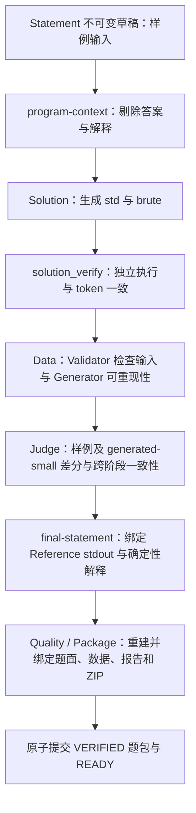

# 执行生成正式样例（2026-09-22）

本说明是当前 MVP v3 的样例策略，取代早期文档中「Statement 生成答案，Solution 与模型答案比较」的描述。
工作流版本边界如下：V1 保留原始固定流程；V2 增加每个 run 最多两次的有界内容重生成；V3（当前）在 V2 基础上生成执行样例，并由独立的 std/brute 结果定稿答案。

## 证据流速览

图中箭头表示通过门禁后证据的流向。失败不沿箭头发布：内容问题按有界重生成或审核规则处理，基础设施错误保留恢复证据。草稿中的模型答案不会进入 oracle；正式答案只有在全套门禁与题包提交完成后才可导出。

## 阶段与权威

1. **Statement** 设计小规模合法输入，提示词要求 `samples[].output` 为 `""`，解释留空。`ProblemSpec` 是不可变草稿；为兼容供应商输出形状，非空模型答案仍可保留为草稿证据，绝不作为 oracle。
2. **Solution** 请求使用 `cpgen.program-context/v1`：从完整已提交输入投影题意、约束和样例输入，删除样例答案与解释。`source_input_digest` 绑定完整原输入，stage input digest 不变。生成、已提交读取和未完成请求恢复使用同一投影。Data 请求也使用该投影。
3. **solution_verify** 在固定 Docker 工具链下编译 std/brute，并对每个草稿样例输入运行二者。要求独立物理调用及 token 一致；不再发布模型 `.out`。Reference 的单条 `matches=true` 仅表示该进程成功，整个报告通过必须有独立 brute 的有序配对证据。相同源码（忽略两端空白）在草稿绑定时拒绝。
4. **data_verify** 保持原门禁：Validator 验证所有样例与生成输入；Generator 对每个 case 做两次独立执行验证字节可重现。计划仍至少包含两组 small、一组 boundary、一组 stress。
5. **Judge** 对所有样例和所有 generated-small 做独立 std/brute 差分；对其余生成数据执行 Reference。样例还必须与 Solution 阶段双方已达成一致的执行结果一致，以拦截跨阶段输出漂移。任一过程失败或差异都保留失败证据并保守分流。
6. **Judge 定稿** 仅在整个 Judge 通过后生成 `judge/final-statement.json`。该新制品含草稿摘要、Judge 报告摘要、语言、最终样例和渲染后的题面。答案逐字节读取已验证的 Reference stdout；输入保留草稿原字节。它和 Judge 报告、答案、dataset 通过同一阶段提交附加。
7. **Quality / Package** 继续验证固定 checker 的正负 canary 和每个 case。Package 从只读证据链重建最终题面；`statement/samples.json` 包含同一 finalization，`.md`、样例输入输出、测试 `.in/.ans` 精确绑定。导出仍重建整个预期 ZIP，并检查当前 Quality、包记录、manifest 与真实字节。

## 样例解释

最终解释由确定性函数 `FinalSampleExplanation` 根据最终输出生成，描述输出 token 数与显示顺序。原 `samples[].explanation` 无论是否看似正确都不复制。定稿校验器重新计算解释，Package 同时绑定它与题面及样例，不允许仅改输出而保留旧样例解释。

当前说明是输出说明，不是算法逐步推演。复杂题目的语义讲解需要未来单独设计可验证执行轨迹或审核环节；本次不增加会再次手算答案的模型调用。Statement 提示词要求题意/格式描述不包含样例专属讨论；Solution editorial 只讨论通用算法、正确性、复杂度和 brute 边界。宿主无法普遍证明任意自然语言题意、editorial 或任意两段程序的语义独立性；源码不同和有限差分不是数学正确性的证明。

## 失败与边界

- std/brute 分歧、CE、非零退出、TLE/MLE/OLE 维持失败报告/审核分流，不能定稿。提示词要求 brute 在超出支持范围时非零退出，不允许回退到 std 或输出近似值。
- 输入非法仍由原 Validator 门禁拦截；Solution 提前的样例执行不代表输入已合法，更不授予正式样例或发布权。
- 缺失执行证据、infra error、损坏 blob、格式或定稿字节上限问题返回错误，保留未完成 attempt；不产生 READY。
- 正式样例输出最多 65536 字节、UTF-8/LF、无 NUL；定稿 JSON 最多 1 MiB。保留原程序 stdout，不静默修剪或规范化。
- 目前 brute 能力边界由其程序显式拒绝和真实资源限制落实，不尝试把自然语言复杂度声明推断为通用输入解析器。

## 版本、恢复与预算

| 身份 | V1 工作流 | V2 工作流 | V3 工作流（当前） |
|---|---|---|---|
| 样例策略 | 历史声明样例 | 保留历史样例策略 | 独立执行定稿，模型答案不作为 oracle |
| 内容重生成 | 原固定流程 | 每个 run 最多两次 | 沿用 V2 配额与预算 |
| Solution / Judge 报告 | 历史 v1 | 历史 v1 | v2 |
| Data / Quality 报告 | v1 | v1 | 仍为 v1 |
| 生成题包 manifest | 历史 `cpgen.package/v2` | `cpgen.package/v2` | `cpgen.package/v3` |
| 旧 run 恢复与导出 | 按原持久化身份 | 按原持久化身份 | 按冻结的 V3 身份 |

工作流修订、报告 schema、提示版本和题包 manifest 是不同的版本轴；不能仅凭一个 `v2` 或 `v3` 推断其它身份。此表中的 V1 指 MVP 工作流 V1，不是更早的探测题包格式 v1。

新工作流为 `mvp.idea.statement.similarity.solution.data.judge.package.v3`，新 Solution/Judge 报告为 v2，Statement/Solution 提示词为 v2，导出 manifest 为 `cpgen.package/v3`。Data 默认保留已持久化的 v2 提示；新示例配置显式选择 `llm.data_prompt_version: v5`，保留 generator 的完整 `argv` 示例，并要求计算完整输出字节数后留出 10% 余量。选择进入冻结配置，生成、格式修复、已提交读取及恢复采用同一版本；带重试反馈的 v5 使用 v6 提示。既有 v2/v3/v4 提示字节不变，省略字段的旧配置摘要和提示身份不变。Judge 发现 generated generator OLE 时，现有有界内容重试会回到 Data；已耗尽配额仍进入人工审核，且不调整 1 MiB 沙箱上限。草稿 DTO 仍是 v1 形状；新增 program-context/finalized-statement 为各自 v1。V5 继续使用 V2 的 `content_retries` 有界配额与原有调用、token、成本和时间预算。

草稿重试反馈通过 `llm.draft_retry_feedback_version: v1` 显式启用并写入冻结配置；新示例已启用。省略或留空时，新调用继续使用旧的无反馈协议。对尚未版本化的历史调用，读取与恢复仅通过已持久化的 provider、request digest 和 policy digest 唯一匹配已有的无反馈或带反馈协议，不重发请求，也不在验证失败后降级。缓存来源按原生产 attempt 的序号与开始时间读取反馈。格式修复保留冻结的基础 Data/阶段提示版本与原校验器，反馈仍保留在修复请求的 `original_input` 中；不改写既有调用身份。

旧 V1/V2 工作流不会在新语义下自动恢复或导出，旧报告也不会被当作 V3 证据。兼容路径会按旧 run 持久化的 workflow identity 读取旧包；新配置只用于创建独立的 V3 run。不要修改旧 run 的版本、草稿、SQLite 行或历史迁移文件。迁移 `000028` 只把 V3 加入题包准入触发器允许的工作流身份，保留原 Quality/Package/READY 条件，既有数据行不变。

保持原固定阶段顺序、attempt 身份、沙箱请求身份、调用台账、资源回收证明、预算结算和 artifact publication。定稿无网络、无新增模型调用；新增成本是 Judge 对每个样例多执行一次 brute，以及新的制品字节。在当前 Docker direct 协议下每组样例新增两个容器创建，按实际台账扣减，预算不足照常阻断。未提交的报告/答案不具有发布权。

恢复重新使用相同输入、源码、program、工具链和限额构造原沙箱请求，重放已保留 receipt；定稿纯读取和确定性序列化，复用相同 publication。测试在最终制品声明前中断（此时报告和答案已经写出但未提交），验证恢复不重复 Docker 或模型调用，也不重复计入已发布字节。

## 回归依据

`docs/evidence/executed-samples-2026-09-15.md` 是旧分支 `codex/executed-sample-answers` 的历史验收记录。它记录了当时的夹具/Docker 验证，不能声称当前 V3 实现已经完成同等验收；当前验收仍须以实际运行的命令和新 run 证据为准。

Online Connectivity Decisions 的 DSU/全体顶点连通分量重标记 helper 已重新接入独立的 V3 Docker 测试 `TestExecutedSamplesV3RealDockerConnectivityAndBruteBoundaries`。它验证错误模型答案不影响执行一致结果、brute 超范围非零退出，以及 std/brute 分歧不能通过；同时核对独立物理执行记录和提交报告字节。当前运行证据见 [READY 稳定性复验](../evidence/ready-stability-2026-09-22.md)，不复用旧分支的通过声明。

当前 V3 的实际验证依据是：最短路题（BFS 与 Floyd-Warshall）中错误草稿答案/解释经过全链路成为正确的正式样例和导出包；空答案样例的 Solution 执行验证；Judge 失败回归保留失败证据并阻止定稿。这些是本地模型响应夹具与真实 Docker 的工程回归，不能说明真实模型质量或查重服务质量。

2026-09-22 使用用户指定服务与 `gpt-5.6-luna` 的三个独立新任务均达到 READY，各自完成两次无凭据 CLI 恢复、离线导出及新 Docker 重编译；仅依题意独立实现的算法核对全部 27 组答案。第三轮曾因生成输入输出超限被门禁拒绝，经一次有界 Data 重生成后完成。该连续验收覆盖真实模型与真实 Docker，Similarity 仍使用本地 TLS 夹具；详细运行标识和证据见上述稳定性复验记录。
